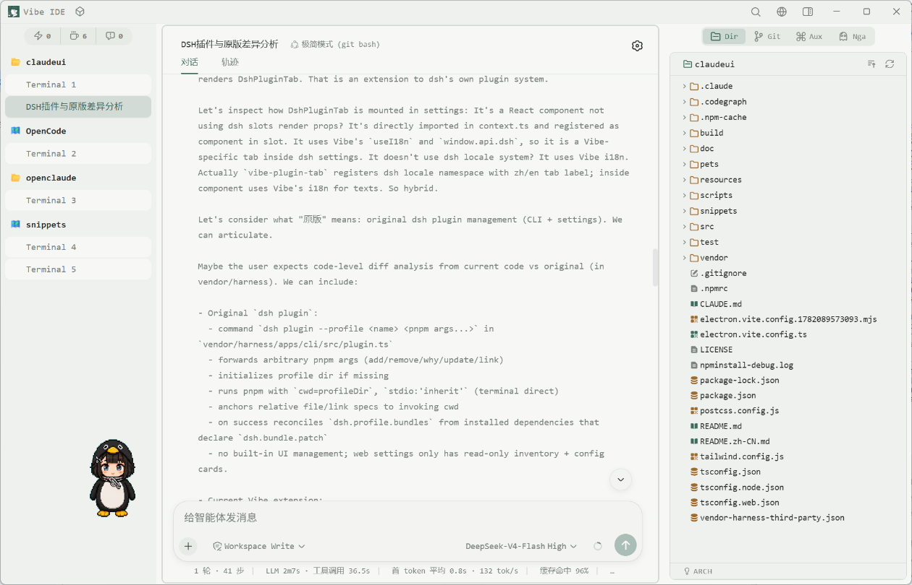
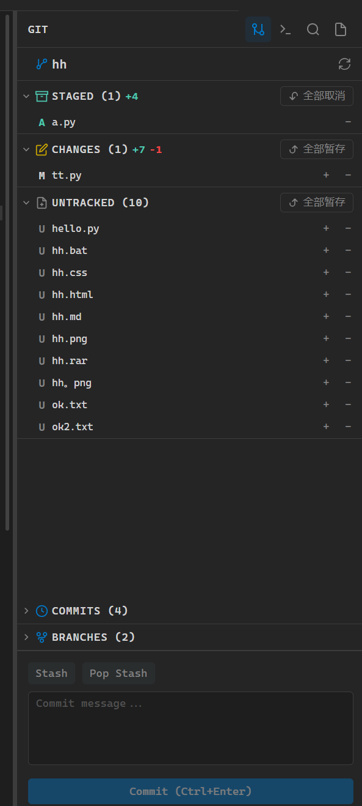
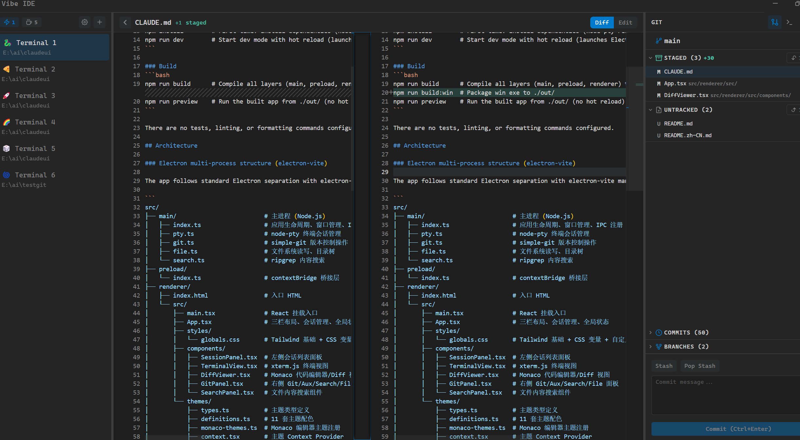

# Vibe IDE

**English** | [中文](README.zh-CN.md)

> An Electron desktop IDE for vibe coding — a three-panel layout with session management, a native terminal, and Git/Aux/Search/File tools, plus built-in Claude Code and DeepSeek Harness (dsh) agent modes, a live code-graph, an embedded browser, and a desktop pet, all designed to keep your flow state uninterrupted.

---

## Quick Start: Three Basic Ways to Use

Vibe IDE’s center area has three core usage modes — **Terminal**, **Claude GUI**, and **dsh** — covering workflows from plain shell commands to AI pair-programming. They share the same left-side session list and right-side Git / Search / File tools. Claude Code and dsh history sessions can also be restored from Session History, so you can pick up where you left off.

### 1. Terminal — Native Shell

- The default center view. Use it for everyday commands, Git operations, scripts, and anything you would normally do in PowerShell / bash.
- Supports multiple terminal sessions, command history, right-click paste, clickable file paths, and `Ctrl+=` / `Ctrl+-` font-size adjustment.
- The most direct, low-level way to work with your project.

### 2. Claude GUI — Claude Code Desktop GUI

- Pick **Claude** when creating a new session to open the built-in Claude Code desktop GUI.
- It is a desktop GUI over the Claude Code CLI: type your request in the chat box and watch streaming replies, thinking blocks, tool-use visualization, and permission prompts live.
- Supports session history, model switching, Plan→Execute, revert/fork, worktree navigation, and more — ideal for delegating coding tasks to Claude.

### 3. dsh — DeepSeek Harness Agent

- Pick **dsh** when creating a new session to enter DeepSeek Harness agent mode.
- Renders the real dsh chat UI in-process, with thinking chains, tool calls, streaming output, and trajectory.
- Sessions stay managed in Vibe’s left panel; dsh plugin management and the shared `~/.dsh` are supported, so it also works with the original dsh CLI.

---

## Screenshots

| Terminal | Git Management |
|----------|---------------|
|  |  |



## Features

### 🔵 Left Panel — Session & Navigation
- **Multi-terminal sessions** — create, clone, rename, switch, and close at will
- **Recent files & directories** — quick reopen, persisted across launches
- **Claude status indicator** — lightweight detection of Claude Code running state, acts as a navigation dashboard
- **Command history** — 500 entries per session, review and copy

### 🟢 Center — Terminal / Editor / Preview / Browser
- **Native terminal** — xterm.js + node-pty (PowerShell / pwsh) with WebGL renderer, clipboard, web-links, unicode-graphemes addons
- **Link jump** — click file paths in terminal output (`./src/file.ts:10`) to open in editor
- **Right-click paste** — paste clipboard content with bracketed paste mode support
- **Shift+Enter** — insert newline without sending command
- **Font size** — `Ctrl+=` / `Ctrl+-` to adjust on the fly
- **Terminal background image** — set via the `--terminal-bg-image` CSS variable, works with WebGL transparency
- **Monaco Editor** — edit files directly, syntax highlight for 30+ languages, encoding auto-detect (jschardet + iconv-lite)
- **Git Diff** — side-by-side comparison with per-hunk details
- **Markdown preview** — GFM + mermaid diagrams, frontmatter, outline, search
- **Image preview** — `file://` viewer
- **Embedded browser** — Chromium webview with URL bar, back/forward, and an element picker that emits CSS selectors as AI input

### 🟡 Right Panel — Multi-Tool Sidebar
- **Git** — visual staging/unstaging, commit (Ctrl+Enter), branch checkout, stash push/pop, push, worktree, line-log, visual commit graph, auto-refresh on file changes
- **Aux** — auxiliary sub-terminals + DocTree (extracts `## Commands` sections from CLAUDE.md)
- **Search** — full-text search/replace powered by ripgrep, regex/case/glob filters, CodeGraph symbol results
- **File** — file tree navigator, recent files, name search, filter rules
- **Appearance** — theme picker, session emoji, panel layout, pet config, font/opacity/snippets toggles
- **Settings** — full keybinding editor (record / customize / reset)

### 🤖 AI Tab — Claude Code Desktop GUI
- Essentially a desktop GUI for Claude Code: CLI subprocess backend with streaming tokens and live markdown rendering
- **Thinking blocks** with durations, kept expanded mid-stream
- **Tool-use visualization** — file edits (with diff), commands, search, web, plan, skill, agent, question, task
- **Permission prompts** — plan / acceptEdits / bypassPermissions modes
- Slash commands, session list/load, model switcher, revert/fork, worktree nav, example prompts
- Plan→Execute pipeline; AskUserQuestion resume

### 🧠 dsh Agent Mode — DeepSeek Harness
- Third center view alongside Terminal and Claude: create a `dsh` session from the new-session picker; dsh history sessions can be resumed from Session History
- Renders the real dsh chat UI in-process (cordis plugin stack), with thinking / tool calls / streaming / trajectory
- Sessions stay in Vibe's left panel; dsh workspace attach, fork, history resume/delete are synchronized back into Vibe
- Follows Vibe themes and fonts through a dsh theme bridge
- Desktop pet can listen to the latest dsh reply as a bubble
- **dsh plugin management** — Settings → dsh → Plugins → *Install Plugin*: add/remove dsh packages and restart dsh in place; shares `~/.dsh` with the original dsh CLI

### 🐾 Desktop Pet
- Animated webp sprite-sheet pet that roams your desktop
- 5 characters: Capvolt, Clawd, Guga, Maodie, Sky Striker Raye
- Draggable, configurable scale / position / frame-rate, 9 logical states (idle/busy/warn/unfocused + transient events)
- Bubble menu with keypad shortcuts + extensible sections

### 🗺️ CodeGraph
- Symbol indexing + call graph (DAGRE visualization)
- Symbol search with kind filters, explore mode, relevant-context finder
- Send context to Claude / Cursor / Codex / opencode / Hermes / Gemini / Kiro

### 🎨 Themes & Custom CSS
- **14 themes** — VS Code Dark, GitHub Light, Vibe Dark, One Dark, Dracula, Nord, Solarized Dark/Light, Monokai, Monokai Pro, Monkey King, Retro Chinese, Hatsune Miku, Lemon Light
- **Custom CSS import (Snippets)** — drop any `.css` into `snippets/` and it's auto-discovered; toggle on/off from Settings → Snippets to **reshape the whole UI without touching source**:
  - Override theme color variables (`--ide-accent`, etc., needs `!important`)
  - Terminal background image / animations / font size / scrollbar styling
  - 11 bundled snippets: starry-night, dont-starve, macos, nes-8bit, nyan-cat, Bloodborne, …

### 🎮 Extras
- **Session History** — browse/search Claude Code sessions (TUI/GUI) and dsh sessions; resume or delete from one place
- **Mujica** — multi-agent Claude orchestra conductor (parallel sessions visualized as a band)
- Mini-games: 2048, Sandspiel (falling sand), Balatro (poker roguelike), Fruit Ninja, Vampire Survivors
- **OCR** — Tesseract.js (chi_sim + eng) on images / screenshots
- **i18n** — Chinese / English
- **Filesystem watcher** — live refresh on cwd changes

---

## Tech Stack

| Layer | Technology |
|-------|------------|
| **Framework** | Electron + electron-vite |
| **UI** | React 18 + TypeScript + Tailwind CSS |
| **Terminal** | xterm.js (WebGL / clipboard / web-links / unicode-graphemes) + node-pty |
| **Editor** | Monaco Editor (`@monaco-editor/react`) |
| **AI** | Claude Code CLI subprocess (stream-json) |
| **dsh agent** | DeepSeek Harness subprocess + vendored cordis client stack |
| **Git** | simple-git |
| **Search** | ripgrep (rg) + Node.js fallback |
| **Code graph** | `@colbymchenry/codegraph` CLI (symbol indexing / call analysis) + dagre (layout) |
| **Markdown** | react-markdown + remark-gfm + mermaid |
| **OCR** | tesseract.js |
| **Encoding** | jschardet + iconv-lite |
| **Icons** | lucide-react |
| **Packaging** | electron-builder |

---

## Quick Start

### Prerequisites

- Node.js >= 18
- npm
- pnpm (optional — only needed when rebuilding the vendored dsh harness)
- Windows (primary target)

### Repository Layout

The **dsh agent mode** spawns a local
[deepseek-harness](https://github.com/deepseek-ai/deepseek-harness) server as a subprocess.
The runtime is vendored under `vendor/harness/` and referenced through `file:./vendor/harness/...`,
so a fresh clone already contains everything needed for dsh mode — no side-by-side clone required.

```
claudeui/
├── src/             # Vibe IDE source
└── vendor/harness/  # vendored DeepSeek Harness runtime + CLI
```

If you replace `vendor/harness` from a fresh upstream checkout, rebuild its lib artifacts first:

```bash
cd vendor/harness
pnpm install
npm run build:lib:host && npm run build:lib:client
cd ..
npm install
```

### dsh Presets

`presets/` holds ready-to-use dsh agent presets. Each preset directory is copied into the user
preset root to activate it — no code changes needed:

```bash
cp -r presets/minimal-gitbash "$USERPROFILE/.dsh/.agent-presets/"
```

`presets/minimal-gitbash` is a **Windows-only** variant of the official `minimal` preset: a
two-tool agent (persistent `bash` + `str_replace_editor`) that runs Git Bash explicitly. On
macOS/Linux the shipped `minimal` preset already works out of the box (its default
`/bin/bash` resolves to the system bash), so this preset is not needed there.

Before copying, edit `agent.cordis.yml` and point `shellPath` at the Git Bash installed on that
machine:

```yaml
- id: terminal-bash
  name: '@deepseek-ai/dsh-terminal-bash'
  config:
    timeoutMs: 300000
    shellPath: 'C:\Program Files\Git\bin\bash.exe'   # <- replace with your Git bash.exe path
```

After copying, the preset shows up in the dsh preset picker; set it as the default preset there
(or via `~/.dsh/settings.yaml` → `agent-presets.default`).

### Install & Run (fresh machine)

```bash
# 1. Clone this repo
git clone https://github.com/luguan/vibe-ide.git
cd vibe-ide

# 2. Install & run Vibe IDE
npm install
npm run dev
```

> **Notes:**
> - `node-pty` is a native module requiring C++ build tools on Windows. Make sure `node-gyp` prerequisites are installed (Visual Studio Build Tools with C++ workload).
> - The vendored `file:` dependencies are installed into `node_modules` at `npm install` time — re-run `npm install` after replacing `vendor/harness`.
> - Dev mode auto-discovers the harness at `vendor/harness/apps/cli/lib/bin.js`.

### Privacy: telemetry removed

The harness's only outbound channel — the `session-telemetry-otel` package (OTLP/HTTP logs
to `harness-telemetry.deepseeksvc.com`) — has been **deleted** from the harness source and
rebuilt. There is no analytics SDK, crash reporting, or default outbound traffic besides the
LLM API endpoints you configure. If you ever merge upstream harness changes, re-check for
telemetry regressions; `DSH_TELEMETRY_DISABLED=1` is also kept in `src/main/dsh.ts` as a
defense-in-depth switch (any non-empty value hard-disables the telemetry row).

### Build & Package

```bash
# Compile the project
npm run build

# Package Windows installer (NSIS + 7z)
npm run build:win
```

**dsh runtime in packaged builds:** the harness CLI is bundled inside `resources/app.asar/vendor/harness/apps/cli`.
The installer also places `dsh.cmd` / `dsh.ps1` / `dsh.sh` wrappers in the install root and can add them to
`PATH`, so `dsh` (including plugin management) works outside the IDE too. `DSH_CLI_BIN` remains available
to override the runtime path when needed.


### Preview Built App

```bash
npm run preview
```

---

## Project Structure

```
src/
├── main/                          # Main process (Node.js)
│   ├── index.ts                   # App lifecycle, window, IPC registration, snippet/pet loading
│   ├── ai.ts                      # Claude CLI subprocess (stream-json, permissions, model/mode switching)
│   ├── ai-ask-resume.ts           # AskUserQuestion kill-and-resume
│   ├── ai-plan-execute.ts         # Plan→Execute pipeline
│   ├── ai-revert.ts               # Conversation revert + fork
│   ├── pty.ts                     # node-pty terminal session management
│   ├── git.ts                     # simple-git (status/log/diff/commit/branch/stash/push/worktree/graph)
│   ├── file.ts                    # File system read/write/tree/rename/copy/move
│   ├── search.ts                  # ripgrep content search/replace
│   ├── codegraph.ts               # Symbol indexing + call graph
│   ├── dsh.ts                     # dsh subprocess server + plugin management
│   ├── ocr.ts                     # Tesseract.js OCR
│   └── watcher.ts                 # Filesystem watcher
├── preload/
│   └── index.ts                   # contextBridge (terminal/git/file/workspace/search/ai/code/ocr/snippets/pet/…)
├── shared/
│   ├── types.ts                   # IPC channel constants + shared types
│   └── encodings.ts               # Encoding groups for iconv-lite
└── renderer/
    └── src/
        ├── App.tsx                # Layout, center-view switcher, global shortcuts
        ├── aiStore.ts             # AI session state store
        ├── mujicaStore.ts         # Mujica multi-agent state store
        ├── dsh/                   # dsh cordis assembly + theme bridge + history helpers
        ├── i18n.ts                # Chinese/English i18n
        ├── shortcuts.ts           # Keybinding definitions + persistence
        ├── themes/                # 14 themes + Monaco themes + ThemeProvider
        ├── languages/             # Monaco tokenizer patches (JSX/Python/Shell)
        ├── utils/                 # Shared utilities
        └── components/
            ├── SessionPanel.tsx   # Left sidebar: sessions + recent files
            ├── TerminalView.tsx   # xterm.js terminal view
            ├── DiffViewer.tsx     # Monaco Editor / Diff viewer
            ├── RightPanel.tsx     # Right panel orchestrator
            ├── GitTab.tsx         # Git version control tab
            ├── GitGraph.tsx       # Visual commit graph
            ├── AuxTab.tsx         # Aux terminal + DocTree
            ├── FileTab.tsx        # File explorer
            ├── SearchPanel.tsx    # Ripgrep search
            ├── AiTab.tsx          # Claude AI chat panel
            ├── DshView.tsx        # dsh agent view (chat UI inside Vibe center)
            ├── DshPluginTab.tsx   # dsh plugin install/uninstall UI
            ├── HistoryView.tsx    # Session history browser (Claude + dsh)
            ├── BrowserView.tsx    # Embedded browser + element picker
            ├── MarkdownPreview.tsx# Markdown + mermaid preview
            ├── ImagePreview.tsx   # Image viewer
            ├── QuickOpen.tsx      # Ctrl+P fuzzy file open
            ├── NavBar.tsx         # Floating recent-files breadcrumb
            ├── OutlinePanel.tsx   # Document outline
            ├── SettingsPanel.tsx  # Keybinding editor
            ├── AppearancePanel.tsx# Theme / pet / layout config
            ├── DesktopPet/        # Animated pet (sprite, state map, bubble menu)
            ├── CodeGraph*.tsx     # Call graph + symbol search
            └── Game*.tsx          # Launcher: Session History, Mujica, 2048, Sandspiel, Balatro, Fruit Ninja, Vampire Survivors

pets/                              # Pet sprite sheets (5 characters)
snippets/                          # CSS snippets (toggle in Settings → Snippets)
```

---

## Keyboard Shortcuts

| Shortcut | Action |
|----------|--------|
| `Ctrl+P` | Quick open file |
| `Ctrl+F` | Focus search panel |
| `Ctrl+H` | Command history (terminal / dsh) |
| `Ctrl+S` | Save file edits |
| `Ctrl+Enter` | Commit Git changes |
| `Ctrl+↑` / `Ctrl+↓` | Switch terminal session |
| `Ctrl+←` / `Ctrl+→` | Switch right panel tab |
| `Ctrl+=` / `Ctrl+-` | Increase / decrease terminal font size |
| `Shift+Enter` | Insert newline in terminal (without sending) |
| `Alt+K` | Open CodeGraph search |
| `Alt+F` | Search terminal |
| `Alt+←` / `Alt+→` | Navigate back / forward |
| `Long-press Alt` | Show NavBar (recent files) |
| `Right-click` | Terminal copy / paste |
| `Esc` | Close diff view / preview / go back |

> Shortcuts are fully customizable in **Settings → Keybindings**.

---

## Related Projects

- [electron-vite](https://github.com/alex8088/electron-vite)
- [xterm.js](https://github.com/xtermjs/xterm.js)
- [Monaco Editor](https://github.com/microsoft/monaco-editor)
- [Claude Code](https://github.com/anthropics/claude-code)
- [dagre](https://github.com/dagrejs/dagre)
- [mermaid](https://github.com/mermaid-js/mermaid)
- [tesseract.js](https://github.com/naptha/tesseract.js)

---

## License

[MIT](LICENSE)
