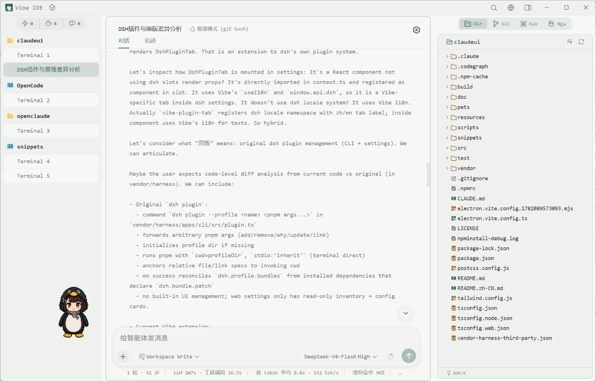
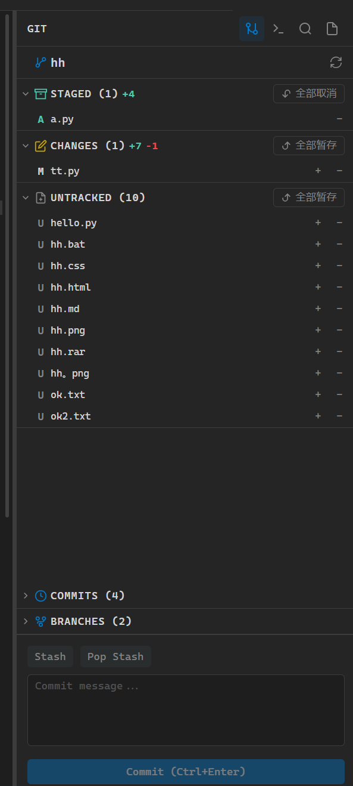
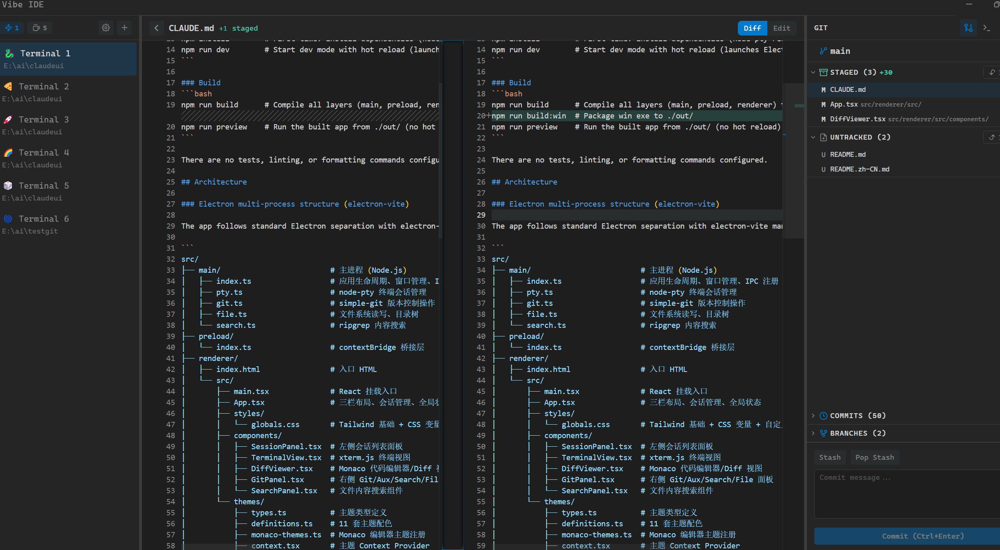

# Vibe IDE

**English** | [中文](README.zh-CN.md)

> An Electron desktop IDE for vibe coding — a three-panel layout with session management, a native terminal, and Git/Aux/Search/File tools, plus built-in Claude Code and pi agent backends, a live code-graph, an embedded browser, and a desktop pet, all designed to keep your flow state uninterrupted.

---

## Quick Start: Three Basic Ways to Use

Vibe IDE’s center area has three core usage modes — **Terminal**, **Claude GUI**, and **pi** — covering workflows from plain shell commands to AI pair-programming. The two AI modes share the same chat UI; Claude Code and pi history sessions can also be restored from Session History, so you can pick up where you left off.

### 1. Terminal — Native Shell

- The default center view. Use it for everyday commands, Git operations, scripts, and anything you would normally do in PowerShell / bash.
- Supports multiple terminal sessions, command history, right-click paste, clickable file paths, and `Ctrl+=` / `Ctrl+-` font-size adjustment.
- The most direct, low-level way to work with your project.

### 2. Claude GUI — Claude Code Desktop GUI

- Pick **Claude** when creating a new session to open the built-in Claude Code desktop GUI.
- It is a desktop GUI over the Claude Code CLI: type your request in the chat box and watch streaming replies, thinking blocks, tool-use visualization, and permission prompts live.
- Supports session history, model switching, Plan→Execute, revert/fork, worktree navigation, and more — ideal for delegating coding tasks to Claude.

### 3. pi — Alternative AI Backend

- Pick **Pi** when creating a new session (or start a Claude session and switch the backend while the conversation is empty) to drive the same chat UI with the `pi` CLI instead of Claude Code.
- pi runs as an RPC subprocess and keeps its own session history under `~/.pi/agent/sessions`, browsable and resumable from Session History.
- Supports model selection, thinking levels, permission prompts, and the same streaming / tool-use rendering as the Claude backend.

---

## Screenshots

| Terminal | Git Management |
|----------|---------------|
|  |  |



## Features

### 🔵 Left Panel — Session & Navigation
- **Multi-terminal sessions** — create, clone, rename, switch, and close at will
- **Recent files & directories** — quick reopen, persisted across launches
- **Claude status indicator** — lightweight detection of Claude Code running state, acts as a navigation dashboard
- **Command history** — 500 entries per session, review and copy

### 🟢 Center — Terminal / Editor / Preview / Browser
- **Native terminal** — xterm.js + node-pty (PowerShell / pwsh) with WebGL renderer, clipboard, web-links, unicode-graphemes addons
- **Link jump** — click file paths in terminal output (`./src/file.ts:10`) to open in editor
- **Right-click paste** — paste clipboard content with bracketed paste mode support
- **Shift+Enter** — insert newline without sending command
- **Font size** — `Ctrl+=` / `Ctrl+-` to adjust on the fly
- **Terminal background image** — set via the `--terminal-bg-image` CSS variable, works with WebGL transparency
- **Monaco Editor** — edit files directly, syntax highlight for 30+ languages, encoding auto-detect (jschardet + iconv-lite)
- **Git Diff** — side-by-side comparison with per-hunk details
- **Markdown preview** — GFM + mermaid diagrams, frontmatter, outline, search
- **Image preview** — `file://` viewer
- **Embedded browser** — Chromium webview with URL bar, back/forward, and an element picker that emits CSS selectors as AI input

### 🟡 Right Panel — Multi-Tool Sidebar
- **Git** — visual staging/unstaging, commit (Ctrl+Enter), branch checkout, stash push/pop, push, worktree, line-log, visual commit graph, auto-refresh on file changes
- **Aux** — auxiliary sub-terminals + DocTree (extracts `## Commands` sections from CLAUDE.md)
- **Search** — full-text search/replace powered by ripgrep, regex/case/glob filters, CodeGraph symbol results
- **File** — file tree navigator, recent files, name search, filter rules
- **Appearance** — theme picker, session emoji, panel layout, pet config, font/opacity/snippets toggles
- **Settings** — full keybinding editor (record / customize / reset)

### 🤖 AI Tab — Claude Code Desktop GUI
- Essentially a desktop GUI for Claude Code: CLI subprocess backend with streaming tokens and live markdown rendering
- **Thinking blocks** with durations, kept expanded mid-stream
- **Tool-use visualization** — file edits (with diff), commands, search, web, plan, skill, agent, question, task
- **Permission prompts** — plan / acceptEdits / bypassPermissions modes
- Slash commands, session list/load, model switcher, revert/fork, worktree nav, example prompts
- Plan→Execute pipeline; AskUserQuestion resume

### 🧠 pi Backend — Alternative AI Agent
- Second AI backend alongside Claude Code, selectable when creating a session (or by switching backend in an empty conversation)
- Runs the `pi` CLI (`@earendil-works/pi-ai`) as an RPC subprocess; the same AiTab renders streaming replies, thinking, tool calls, and permissions
- Own session history in `~/.pi/agent/sessions`: list, search, preview, resume, and delete from Session History
- Model picker plus per-model thinking levels; desktop pet can listen to the latest pi reply as a bubble

### 🐾 Desktop Pet
- Animated webp sprite-sheet pet that roams your desktop
- 5 characters: Capvolt, Clawd, Guga, Maodie, Sky Striker Raye
- Draggable, configurable scale / position / frame-rate, 9 logical states (idle/busy/warn/unfocused + transient events)
- Bubble menu with keypad shortcuts + extensible sections

### 🗺️ CodeGraph
- Symbol indexing + call graph (DAGRE visualization)
- Symbol search with kind filters, explore mode, relevant-context finder
- Send context to Claude / Cursor / Codex / opencode / Hermes / Gemini / Kiro

### 🎨 Themes & Custom CSS
- **14 themes** — VS Code Dark, GitHub Light, Vibe Dark, One Dark, Dracula, Nord, Solarized Dark/Light, Monokai, Monokai Pro, Monkey King, Retro Chinese, Hatsune Miku, Lemon Light
- **Custom CSS import (Snippets)** — drop any `.css` into `snippets/` and it's auto-discovered; toggle on/off from Settings → Snippets to **reshape the whole UI without touching source**:
  - Override theme color variables (`--ide-accent`, etc., needs `!important`)
  - Terminal background image / animations / font size / scrollbar styling
  - 11 bundled snippets: starry-night, dont-starve, macos, nes-8bit, nyan-cat, diablo, …

### 🎮 Extras
- **Session History** — browse/search Claude Code sessions (TUI/GUI) and pi sessions; resume or delete from one place
- **Mujica** — multi-agent Claude orchestra conductor (parallel sessions visualized as a band)
- Mini-games: 2048, Sandspiel (falling sand), Balatro (poker roguelike), Fruit Ninja, Vampire Survivors
- **OCR** — Tesseract.js (chi_sim + eng) on images / screenshots
- **i18n** — Chinese / English
- **Filesystem watcher** — live refresh on cwd changes

---

## Tech Stack

| Layer | Technology |
|-------|------------|
| **Framework** | Electron + electron-vite |
| **UI** | React 18 + TypeScript + Tailwind CSS |
| **Terminal** | xterm.js (WebGL / clipboard / web-links / unicode-graphemes) + node-pty |
| **Editor** | Monaco Editor (`@monaco-editor/react`) |
| **AI** | Claude Code CLI subprocess (stream-json) |
| **pi agent** | `@earendil-works/pi-ai` CLI subprocess (RPC) |
| **Git** | simple-git |
| **Search** | ripgrep (rg) + Node.js fallback |
| **Code graph** | `@colbymchenry/codegraph` CLI (symbol indexing / call analysis) + dagre (layout) |
| **Markdown** | react-markdown + remark-gfm + mermaid |
| **OCR** | tesseract.js |
| **Encoding** | jschardet + iconv-lite |
| **Icons** | lucide-react |
| **Packaging** | electron-builder |

---

## Quick Start

### Prerequisites

- Node.js >= 18
- npm
- Windows (primary target)

### Install & Run (fresh machine)

**Prerequisites:** Node.js >= 18, Git, Windows, and Visual Studio Build Tools
with the "Desktop development with C++" workload (node-pty is a native module).

**1. Clone**
```bash
git clone https://github.com/luguan/vibe-ide.git
cd vibe-ide
```

**2. Add `.npmrc`** (required in mainland China — otherwise electron's binary
download fails and `npm run dev` throws `Electron uninstall`)
```
registry=https://registry.npmmirror.com/
electron_mirror=https://npmmirror.com/mirrors/electron/
electron_builder_binaries_mirror=https://npmmirror.com/mirrors/electron-builder-binaries/
```
Outside China, drop the `registry` line (keep the two `electron_*` mirrors).

**3. Install dependencies — `npm ci`, never `npm install`**
```bash
npm ci
```
`npm ci` installs exactly the locked versions without re-resolving `^` ranges —
an `npm install` re-resolves and drifts the tree.

**4. Verify dev**
```bash
npm run dev
```
Open a Claude or pi session in the app and send a message to verify the AI backend works.

**5. Package**
```bash
npm run build:win
```
Outputs `dist/Vibe IDE Setup x64.exe` (NSIS) + a 7z. Install it and open a session to verify.

> **Gotchas (each was a real root cause):**
> - The electron **binary** must come through the mirror (step 2), or dev
>   throws `Electron uninstall`.
> - `node-pty` needs the VS C++ workload, or its build fails.
> - The `pi` backend needs the `pi` CLI on `PATH` (or resolved from its install dir).

### Build & Package

```bash
# Compile the project
npm run build

# Package Windows installer (NSIS + 7z)
npm run build:win
```

### Preview Built App

```bash
npm run preview
```

---

## Project Structure

```
src/
├── main/                          # Main process (Node.js)
│   ├── index.ts                   # App lifecycle, window, IPC registration, snippet/pet loading
│   ├── ai.ts                      # Claude CLI subprocess (stream-json, permissions, model/mode switching)
│   ├── ai-ask-resume.ts           # AskUserQuestion kill-and-resume
│   ├── ai-plan-execute.ts         # Plan→Execute pipeline
│   ├── ai-revert.ts               # Conversation revert + fork
│   ├── pty.ts                     # node-pty terminal session management
│   ├── git.ts                     # simple-git (status/log/diff/commit/branch/stash/push/worktree/graph)
│   ├── file.ts                    # File system read/write/tree/rename/copy/move
│   ├── search.ts                  # ripgrep content search/replace
│   ├── codegraph.ts               # Symbol indexing + call graph
│   ├── ocr.ts                     # Tesseract.js OCR
│   └── watcher.ts                 # Filesystem watcher
├── preload/
│   └── index.ts                   # contextBridge (terminal/git/file/workspace/search/ai/code/ocr/snippets/pet/…)
├── shared/
│   ├── types.ts                   # IPC channel constants + shared types
│   └── encodings.ts               # Encoding groups for iconv-lite
└── renderer/
    └── src/
        ├── App.tsx                # Layout, center-view switcher, global shortcuts
        ├── aiStore.ts             # AI session state store
        ├── mujicaStore.ts         # Mujica multi-agent state store
        ├── i18n.ts                # Chinese/English i18n
        ├── shortcuts.ts           # Keybinding definitions + persistence
        ├── themes/                # 14 themes + Monaco themes + ThemeProvider
        ├── languages/             # Monaco tokenizer patches (JSX/Python/Shell)
        ├── utils/                 # Shared utilities
        └── components/
            ├── SessionPanel.tsx   # Left sidebar: sessions + recent files
            ├── TerminalView.tsx   # xterm.js terminal view
            ├── DiffViewer.tsx     # Monaco Editor / Diff viewer
            ├── RightPanel.tsx     # Right panel orchestrator
            ├── GitTab.tsx         # Git version control tab
            ├── GitGraph.tsx       # Visual commit graph
            ├── AuxTab.tsx         # Aux terminal + DocTree
            ├── FileTab.tsx        # File explorer
            ├── SearchPanel.tsx    # Ripgrep search
            ├── AiTab.tsx          # Claude AI chat panel
            ├── HistoryView.tsx    # Session history browser (Claude + pi)
            ├── BrowserView.tsx    # Embedded browser + element picker
            ├── MarkdownPreview.tsx# Markdown + mermaid preview
            ├── ImagePreview.tsx   # Image viewer
            ├── QuickOpen.tsx      # Ctrl+E fuzzy file open
            ├── NavBar.tsx         # Floating recent-files breadcrumb
            ├── OutlinePanel.tsx   # Document outline
            ├── SettingsPanel.tsx  # Keybinding editor
            ├── AppearancePanel.tsx# Theme / pet / layout config
            ├── DesktopPet/        # Animated pet (sprite, state map, bubble menu)
            ├── CodeGraph*.tsx     # Call graph + symbol search
            └── Game*.tsx          # Launcher: Session History, Mujica, 2048, Sandspiel, Balatro, Fruit Ninja, Vampire Survivors

pets/                              # Pet sprite sheets (5 characters)
snippets/                          # CSS snippets (toggle in Settings → Snippets)
```

---

## Keyboard Shortcuts

| Shortcut | Action |
|----------|--------|
| `Ctrl+Click` | Add file / Markdown block to chat (as `@` reference) |
| `Ctrl+F` | Focus search panel |
| `Ctrl+H` | Command history (terminal / AI) |
| `Ctrl+S` | Save file edits |
| `Ctrl+Enter` | Commit Git changes |
| `Ctrl+↑` / `Ctrl+↓` | Switch terminal session |
| `Ctrl+←` / `Ctrl+→` | Switch right panel tab |
| `Ctrl+=` / `Ctrl+-` | Increase / decrease terminal font size |
| `Shift+Enter` | Insert newline in terminal (without sending) |
| `Alt+K` | Open CodeGraph search |
| `Alt+F` | Search terminal |
| `Alt+←` / `Alt+→` | Navigate back / forward |
| `Long-press Alt` | Show NavBar (recent files) |
| `Right-click` | Terminal copy / paste |
| `Esc` | Close diff view / preview / go back |

> Shortcuts are fully customizable in **Settings → Keybindings**.

---

## Related Projects

- [electron-vite](https://github.com/alex8088/electron-vite)
- [xterm.js](https://github.com/xtermjs/xterm.js)
- [Monaco Editor](https://github.com/microsoft/monaco-editor)
- [Claude Code](https://github.com/anthropics/claude-code)
- [dagre](https://github.com/dagrejs/dagre)
- [mermaid](https://github.com/mermaid-js/mermaid)
- [tesseract.js](https://github.com/naptha/tesseract.js)

---

## License

[MIT](LICENSE)
