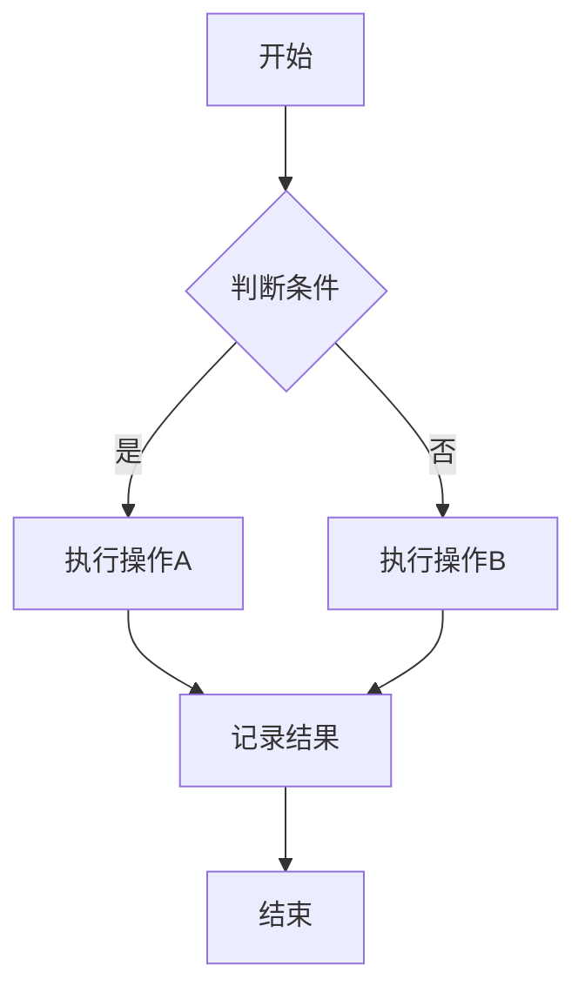
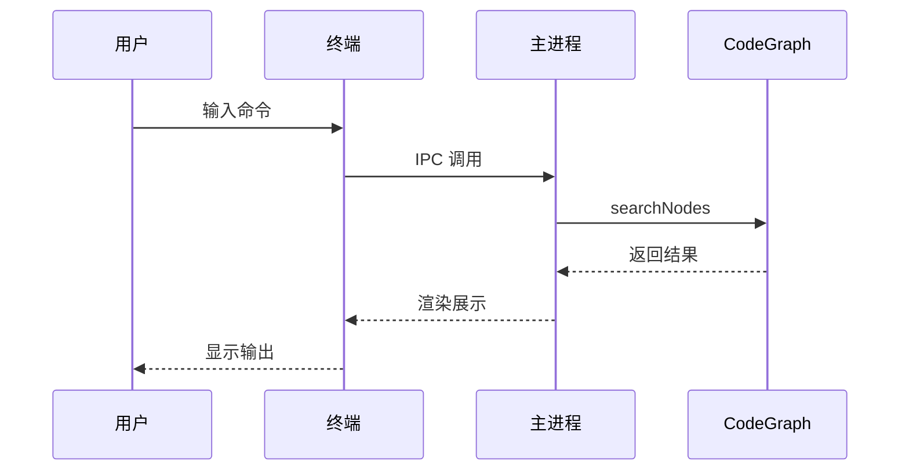
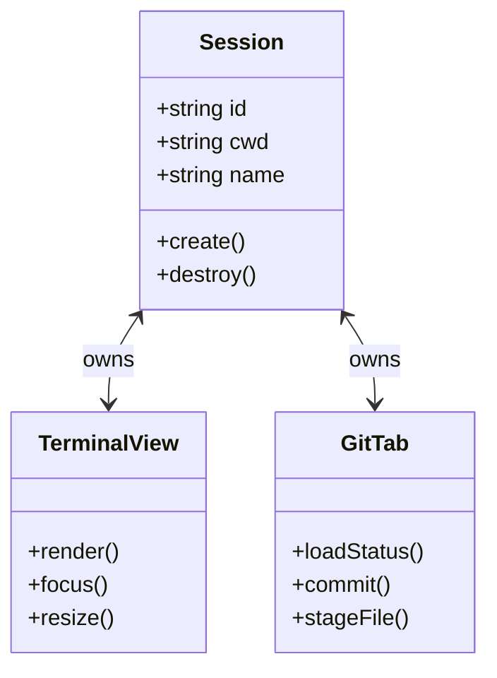
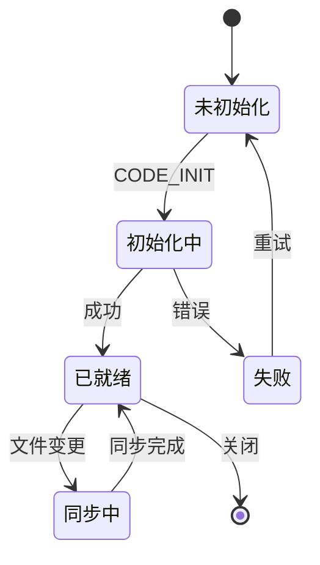
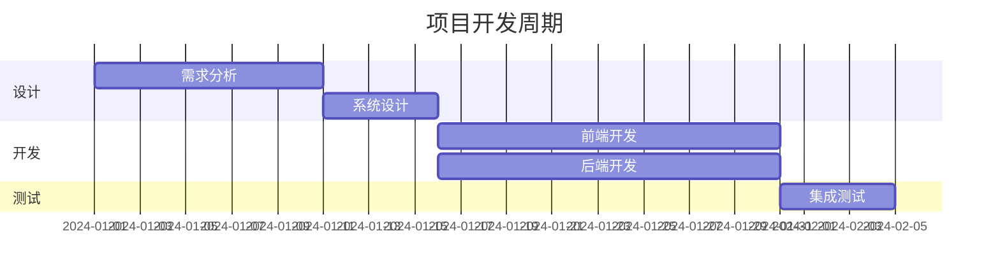

# Mermaid 渲染测试

## 流程图



## 时序图



## 类图



## 状态图



## Gantt 图



## 无效语法（错误兜底）

```mermaid
this is not valid mermaid syntax at all
```

## 普通 Markdown 特性（确保不受影响）

- 列表项 1
- 列表项 2

**粗体** 和 *斜体* 文本。

```typescript
const x: number = 42
console.log(x)
```

| 列A | 列B |
|------|------|
| 数据1 | 数据2 |
